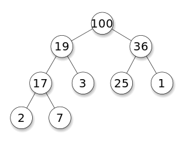

# Algorithm Practice on Programmers


_출처: [프로그래머스 코딩 테스트 연습](https://programmers.co.kr/learn/challenges)_

- Python3, Java
- 코딩 테스트 연습에 공개된 문제가 아닌, 기업 입사 코딩 테스트 등에 나온 문제는 법적 문제상 올리면 안된다. [(출처)](https://programmers.zendesk.com/hc/ko/articles/360034546572-프로그래머스의-알고리즘-문제-풀이를-개인-블로그-깃헙-기타-사이트에-올려도-되나요-)
- [Java Stream을 이용한 함수형 프로그래밍](functional_programming.md)

## Map
|언어|인터페이스|객체|라이브러리|설명|
|---:|---|---|---|---|
|Python3||dict<br>defaultdict|built-in type<br>collections||
|Java|Map|HashMap<br>TreeMap<br>LinkedHashMap|java.util|Time complexity와 iteration Order 차이<br>(전화번호 목록.java 참고)|

### 요약
- Hash: string이나 다른 object를 int 정수 코드로 변환
- Map: Key: Value 형태의 Set, Key는 unique하며 str이 가능
- get()/put()이 O(1)로 수렴하여 빠르게 탐색 가능
- str, tuple 등 여러 타입의 Key로 value를 불러올 수 있음

### 문제 풀이
- Level 1 / [완주하지 못한 선수](https://programmers.co.kr/learn/courses/30/lessons/42576)
/ [Python3](hash/완주하지%20못한%20선수.py)
/ [Java](hash/완주하지%20못한%20선수.java)
- Level 2 / [전화번호 목록](https://programmers.co.kr/learn/courses/30/lessons/42577)
/ [Python3](hash/전화번호%20목록.py)
/ [Java](hash/전화번호%20목록.java)
- Level 2 / [위장](https://programmers.co.kr/learn/courses/30/lessons/42578)
/ [Python3](hash/위장.py)
/ [Java](hash/위장.java)
- Level 3 / [베스트앨범](https://programmers.co.kr/learn/courses/30/lessons/42579)
/ [Python3](hash/베스트앨범.py)
/ [Java](hash/베스트앨범.java)


## Set
|언어|인터페이스|객체|라이브러리|
|---:|---|---|---|
|Python3||set|built-in type|
|Java|Set|HashSet|java.util|

순서가 없으며 고유한 값이 저장되는 자료구조


## Trie


### 요약
- 문자열 검색에 특화된 자료 구조
- Trie를 안쓴다면 하나하나 찾아서 비교해야 한다.

### 참고
- https://en.wikipedia.org/wiki/Trie
- https://brunch.co.kr/@springboot/75

### 트리(Tree)
트리(Tree)는 정점과 간선으로 구성되는 계층 관계를 나타내는 자료 구조다. 가장 상위 노드는 루트(root), 가장 하위 노드는 리프(leaf)라고 부른다. 트라이도 트리의 한 종류다.

### 트라이(Trie)
트라이(Trie)는 보통 Prefix Tree, Digital Search Tree, Retrival Tree 로 불린다. 트라이는 retrieval에서 따왔다. 트라이는 문자열 Key로 사용하는 동적인 Set을 저장하는 확장 트리 자료구조다. 쉽게 말해 springboot를 찾기 위해 s를 찾고, 그 다음에 p, r, ... 순서로 가는 구조다.

전화번호_목록.py를 참고하자.


## 스택/큐(Stack/Queue)
### 요약
    Stack: LIFO(Last Input First Output)
    Queue: FIFO(first Input First Output)

수행할 데이터의 순서를 명확하게 지정하여 불필요한 계산 과정을 줄일 수 있다. 예컨대 함수 실행 처리를 Stack 대신 Queue를 이용한다면, 매번 각 함수 처리 전 하위 함수 처리가 완료되었는지 따져야 한다.

스택/큐에 규칙성을 가지게 넣어놓고 끝점으로만 처리를 해나가면 반복되는 검사량을 줄일 수 있다. (탑, 주식가격 문제 참고)

스택/큐의 대표 예시로 메모리와 스케줄링이 있다.

Deque는 stack과 queue를 모두 이용하도록 합친 형태다.

### Stack
|언어|인터페이스|객체|라이브러리|
|---:|---|---|---|
|Python3||list|built-in type|
|Java||Stack|java.util|

### Queue
|언어|인터페이스|객체|라이브러리|
|---:|---|---|---|
|Python3||deque|collections|
|Java|Queue|LinkedList<br>PriorityQueue|java.util|

### 문제 풀이
- Level 2 / [탑](https://programmers.co.kr/learn/courses/30/lessons/42588)
/ [Python3](stack_queue/탑.py)
/ [Java](stack_queue/탑.java)
- Level 2 / [다리를 지나는 트럭](https://programmers.co.kr/learn/courses/30/lessons/42583)
/ [Python3](stack_queue/다리를%20지나는%20트럭.py)
/ [Java](stack_queue/다리를_지나는_트럭.java)
- Level 2 / [기능개발](https://programmers.co.kr/learn/courses/30/lessons/42586)
/ [Python3](stack_queue/기능개발.py)
/ [Java](stack_queue/기능개발.java)
- Level 2 / [프린터](https://programmers.co.kr/learn/courses/30/lessons/42587)
/ [Python3](stack_queue/프린터.py)
/ [Java](stack_queue/프린터.java)
- Level 2 / [쇠막대기](https://programmers.co.kr/learn/courses/30/lessons/42585)
/ [Python3](stack_queue/쇠막대기.py)
/ [Java](stack_queue/쇠막대기.java)
- Level 2 / [주식개발](https://programmers.co.kr/learn/courses/30/lessons/42584)
/ [Python3](stack_queue/주식개발.py)
/ [Java](stack_queue/주식개발.java)

### 참고
- [Python Stack/Queue Example](https://docs.python.org/3/tutorial/datastructures.html?highlight=list#using-lists-as-queues)
- [스택_큐 개념](https://mygumi.tistory.com/357)


## 힙(Heap)
|언어|인터페이스|객체|라이브러리|설명|
|---:|---|---|---|---|
|Python3||heapq|collections|가장 앞쪽 값 기준으로 min heap 작동|
|Java|PriorityQueue|ProrityQueue|java.util|Comparator로 기준 지정|



- A가 B의 부모노드(parent node) 이면, A의 키(key)값과 B의 키값 사이에는 대소관계가 성립하는 완전이진트리
- Heap Property를 만족하는 Complete Binary Tree. **유동적인 리스트에서 최댓값/최솟값을 빠르게 찾기 위함.** root node로 올수록 클 경우 max-heap, 작으면 min-heap이다.
- 라이브러리가 제공하는 힙은 기본 min-heap이다.
- 두 개를 합쳐 최대/최소값 접근을 O(1)로 하는 min-max heap도 있다. 아종으로 symmetric min-max heap이 있다. 간단한 문제라면 - 이중우선순위큐 문제 참고 - heap 2개를 이용하여 유사 min-max heap을 만들 수 있다.

### 참고
- https://ko.wikipedia.org/wiki/힙_(자료_구조)
- https://docs.python.org/3.7/library/heapq.html

### 문제 풀이
- Level 2 / [더 맵게](https://programmers.co.kr/learn/courses/30/lessons/42626)
/ [Python3](heap/더%20맵게.py)
/ [Java](heap/더_맵게.java)
- Level 2 / [라면공장](https://programmers.co.kr/learn/courses/30/lessons/42629)
/ [Python3](heap/라면공장.py)
/ [Java](heap/라면공장.java)
- Level 3 / [디스크 콘트롤러](https://programmers.co.kr/learn/courses/30/lessons/42627)
/ [Python3](heap/디스크%20콘트롤러.py)
/ [Java](heap/디스크_콘트롤러.java)
- Level 3 / [이중우선순위큐](https://programmers.co.kr/learn/courses/30/lessons/42628)
/ [Python3](heap/이중우선순위큐.py)
/ [Java](heap/이중우선순위큐.java)


## 정렬(Sort)
- 컴퓨터 처리 데이터는 양이 매우 많아 search 할 때 많은 시간이 소요된다.
- 정렬을 해두면 이진 탐색(logn) 등 빠른 탐색이 가능하다.
- 다양한 정렬 방법이 있으며 Comparison Sort는 O(nlogn)이 최대 속도다.
- Non-comparision Sort도 있으며 특정 조건이 필요한 걸로 보인다.
- compare 함수를 이용한 방법이 명확하게 풀이할 수 있다. (예. 가장 큰 수)

### 참고
- https://en.wikipedia.org/wiki/Sorting_algorithm
- [파이썬 정렬 사용](https://docs.python.org/ko/3/howto/sorting.html)

### 문제 풀이
- Level 1 / [K번째수](https://programmers.co.kr/learn/courses/30/lessons/42748)
/ [Python3](sort/k번째수.py)
/ [Java](sort/k번째수.java)
- Level 2 / [가장 큰 수](https://programmers.co.kr/learn/courses/30/lessons/42746)
/ [Python3](sort/가장%20큰%20수.py)
/ [Java](sort/가장_큰_수.java)
- Level 2 / [H-Index](https://programmers.co.kr/learn/courses/30/lessons/42747)
/ [Python3](sort/h-index.py)
/ [Java](sort/h_index.java)


## 완전탐색(Brute-force Search)
- 정답을 보장하지만 시간 복잡도는 포기한 최후의 방법 (거의 O(n**2) 이상)
- 사용 조건
    - 문제 데이터 크기가 제한되었거나
    - 'Heuristic'으로 탐색할 목록 범위를 처리 가능한 크기까지 줄인다면
- itertools에 permutations 등을 최대한 활용하자
- 목표에 특정 패턴이 없어 효율적인 방법을 찾을 수 없다면 완전탐색을 하자...
<br>예. '소수찾기' 문제: 수를 조합하기 전에 어떤 패턴으로 소수를 만들 수 있는지 알 수 없음. 일일이 다 만들어보며 소수인지 검사해야 함.

### 참고
- https://en.wikipedia.org/wiki/Brute-force_search
- https://en.wikipedia.org/wiki/Heuristic_(computer_science)

### 문제 풀이
- Level 1 / [모의고사](https://programmers.co.kr/learn/courses/30/lessons/42840)
/ [Python3](brute_force_search/모의고사.py)
/ [Java](brute_force_search/모의고사.java)
- Level 2 / [소수 찾기](https://programmers.co.kr/learn/courses/30/lessons/42839)
/ [Python3](brute_force_search/소수%20찾기.py)
/ [Java](brute_force_search/소수_찾기.java)
- Level 2 / [숫자 야구](https://programmers.co.kr/learn/courses/30/lessons/42841)
/ [Python3](brute_force_search/숫자%20야구.py)
/ [Java](brute_force_search/숫자_야구.java)
- Level 2 / [카펫](https://programmers.co.kr/learn/courses/30/lessons/42842?language=python3)
/ [Python3](brute_force_search/카펫.py)
/ [Java](brute_force_search/카펫.java)


## 탐욕법(Greedy Algorithm)
- global optimal choice를 찾기 위해 매번 local optimal choice를 고르는 Heuristic.
- **단계를 거듭해도 각 단계의 수행 시간이 거의 일정하여 빠르다.**
- global optimal choice를 보장하진 않지만 근사치에 접근한다.
- 완전 탐색하기엔 시간이 부족하거나 global optiaml choice가 증명되면 사용한다.
- [풀이 요령]
    - 완전탐색처럼 쭉 출력해보며 주어진 문제의 패턴을 본다.
    - 그 패턴을 표현하는 가장 간단한 방법을 찾아낸다.
    (저울 문제 참고)
- Kruskal's Algorithm, Prim's Algorithm (섬 연결하기 문제 참고)

### 참고
- https://en.wikipedia.org/wiki/Greedy_algorithm

문제 풀이
- Level 1 / [체육복](https://programmers.co.kr/learn/courses/30/lessons/42862)
/ [Python3](greedy/체육복.py)
/ [Java](greedy/체육복.java)
- Level 2 / [조이스틱](https://programmers.co.kr/learn/courses/30/lessons/42860)
/ [Python3](greedy/조이스틱.py)
/ [Java](greedy/조이스틱.java)
- Level 2 / [큰 수 만들기](https://programmers.co.kr/learn/courses/30/lessons/42883)
/ [Python3](greedy/큰%20수%20만들기.py)
/ [Java](greedy/큰_수_만들기.java)
- Level 2 / [구명보트](https://programmers.co.kr/learn/courses/30/lessons/42885)
/ [Python3](greedy/구명보트.py)
/ [Java](greedy/구명보트.java)
- Level 3 / [섬 연결하기](https://programmers.co.kr/learn/courses/30/lessons/42861)
/ [Python3](greedy/섬%20연결하기.py)
/ [Java](greedy/섬_연결하기.java)
- Level 3 / [단속카메라](https://programmers.co.kr/learn/courses/30/lessons/42884)
/ [Python3](greedy/단속카메라.py)
/ [Java](greedy/단속카메라.java)
- Level 3 / [저울](https://programmers.co.kr/learn/courses/30/lessons/42886)
/ [Python3](greedy/저울.py)
/ [Java](greedy/저울.java)


## 동적계획법(Dynamic Programming)
- 문제를 여러개의 작은 문제로 나누고 그것을 결합하여 풀면서(Divide and Qunquer)
- 이전 단계의 결과를 저장하고 다음 단계에 활용하여 중복된 계산을 최소화한다.
- **귀납적 사고**를 하면 된다. 최댓값을 이어간다: 이전 상태 최댓값으로 현재 상태 최댓값을 계산한다.
    - 도둑질, 서울에서 경산까지 문제처럼 주어진 개념을 길찾기 문제처럼 접근하자.
- (최대 가치) 길찾기 문제가 주로 등장하며 2차원 리스트(행렬) 혹은 해시 구조에 정보를 저장해간다.
- 재귀함수를 이용하면 memoization을 활용하자(예. 정수삼각형 및 상위 레벨)
    - memoization에는 dictionary를 쓰자. 열거형 key(hashble type)는 tuple이어야 한다.
    - 코드는 간단해보여도 대부분 시간 효율성이 안좋거나 depth limit에 걸린다.
- 길찾기 탐색 방향을 정방향/역방향으로 할지 고민해봐야 한다(예. 카드 게임)

### 참고
- https://ko.wikipedia.org/wiki/동적_계획법
- https://www.zerocho.com/category/Algorithm/post/584b979a580277001862f182

### 문제 풀이
- Level 3 / [N으로 표현](https://programmers.co.kr/learn/courses/30/lessons/42895)
/ [Python3](dynamic_programming/N으로%20표현.py)
/ [Java](dynamic_programming/N으로_표현.java)
- Level (1 같은) 3 / 타일 장식물](https://programmers.co.kr/learn/courses/30/lessons/43104)
/ [Python3](dynamic_programming/타일%20장식물.py)
/ [Java](dynamic_programming/타일_장식물.java)
- Level 3 / [정수 삼각형](https://programmers.co.kr/learn/courses/30/lessons/43105)
/ [Python3](dynamic_programming/정수%20삼각형.py)
/ [Java](dynamic_programming/정수_삼각형.java)
- Level 3 / [등굣길](https://programmers.co.kr/learn/courses/30/lessons/42898)
/ [Python3](dynamic_programming/등굣길.py)
/ [Java](dynamic_programming/등굣길.java)
- Level 4 / [카드 게임](https://programmers.co.kr/learn/courses/30/lessons/42896)
/ [Python3](dynamic_programming/카드%20게임.py)
/ [Java](dynamic_programming/카드_게임.java)
- Level 4 / [도둑질](https://programmers.co.kr/learn/courses/30/lessons/42897)
/ [Python3](dynamic_programming/도둑질.py)
/ [Java](dynamic_programming/도둑질.java)
- Level 4 / [서울에서 경산까지](https://programmers.co.kr/learn/courses/30/lessons/42899)
/ [Python3](dynamic_programming/서울에서%20경산까지.py)
/ [Java](dynamic_programming/서울에서_경산까지.java)


## 깊이/너비 우선 탐색(DFS/BFS)
- Graph: 정점과 간선으로 이뤄진 자료구조 / G = (V, E)
- Graph Search: 특정 정점에서 시작해 차례대로 모든 정점을 한 번씩 방문해보기
- 두 방법 모두 노드 방문 여부를 반드시 검사해야 무한루프에 빠지지 않음
- 노드 방문 여부는 보통 1차원 리스트 visited에 0/1 을 채우며 검사한다.
- dict(defaultdict) 자료형으로 graph 구조를 만들어 활용하면 가능한 다음 노드 목록을 O(1)로 가져올 수 있어 빠르다.(예. 여행경로 문제)

### 깊이 우선 탐색(DFS, Depth-First Search)


- 루트 노드에서 시작하여 다음 분기(Branch)로 넘어가기 전에 해당 분기를 완벽히 탐색한다.
- 자기 자신을 호출하는 순환 알고리즘 형태
- Stack 자료구조 혹은 재귀 탐색 사용

### 너비 우선 탐색(BFS, Breadth-First Search)


- 인접한 노드를 먼저 탐색한다.
- 두 노드 사이의 (최단) 경로 찾기에 이용(DFS는 모든 관계 탐색을 해야 한다)
- 재귀 탐색이 불가능하며 Queue 사용

### 참고
- https://yunyoung1819.tistory.com/86
- https://en.wikipedia.org/wiki/Depth-first_search
- https://en.wikipedia.org/wiki/Breadth-first_search

### 문제 풀이
- Level 2 / [타겟 넘버](https://programmers.co.kr/learn/courses/30/lessons/43165)
/ [Python3](dfs_bfs/타겟%20넘버.py)
/ [Java](dfs_bfs/타겟_넘버.java)
- Level 3 / [네트워크](https://programmers.co.kr/learn/courses/30/lessons/43162)
/ [Python3](dfs_bfs/네트워크.py)
/ [Java](dfs_bfs/네트워크.java)
- Level 3 / [단어 변환](https://programmers.co.kr/learn/courses/30/lessons/43163)
/ [Python3](dfs_bfs/단어%20변환.py)
/ [Java](dfs_bfs/단어_변환.java)
- Level 3 / [여행경로](https://programmers.co.kr/learn/courses/30/lessons/43164)
/ [Python3](dfs_bfs/여행경로.py)
/ [Java](dfs_bfs/여행경로.java)


## 이분 탐색(Binary Search)
- 정렬이 된 리스트에서 `O(logn)` 속도로 원하는 값을 찾는 방법
- start, middle, end를 두고 `middle = (start+end)//2` 로 설정한다.
- middle 값이 목표값보다 클 경우 `start = middle +1`, 작으면 `end = middle -1` 로 설정한다.
- `start > end` 될 때까지 반복하면 원하는 값을 찾는다.

### 노하우
- 이분탐색으로 찾는 middle 값은 자연수 범위처럼 -1, +1로 순차적인 간격을 조정하며,
  middle로 계산한 값도 middle이 크면 커지고, 작으면 작아진다.
- mdddle로 계산한 값과 비교할 고정값이 있어야 이분탐색 방향을 정한다.
- middle은 보통 무언가들의 최소 기준점, 경계값이 되어 특정 값을 계산한다.
    - 입국심사에서 총 검사시간과 가능한 같아지도록 각 심사위원이 다룬 인원 수 계산
    - 징검다리에서 간격의 최솟값보다 같거나 크지만 가장 가깝게 되도록 인접한 간격들 더함

### 참고
- https://wootool.tistory.com/62

### 문제 풀이
- Level 3 / [예산](https://programmers.co.kr/learn/courses/30/lessons/43237)
/ [Python3](binary_search/예산.py)
/ [Java](binary_search/예산.java)
- Level 3 / [입국심사](https://programmers.co.kr/learn/courses/30/lessons/43238)
/ [Python3](binary_search/입국심사.py)
/ [Java](binary_search/입국심사.java)
- Level 4 / [징검다리](https://programmers.co.kr/learn/courses/30/lessons/43236)
/ [Python3](binary_search/징검다리.py)
/ [Java](binary_search/징검다리.java)


## 그래프(Graph)

|구현 개념|설명|
|---|---|
|`map<node, Set<nextNode>>`|연속된 흐름을 타며 처리할 때 사용|
|`List<Edge<node, node>>`|크루스칼 알고리즘 등에 사용하기 좋음|

|언어|인터페이스|객체|라이브러리|설명|
|---:|---|---|---|---|
|Python3||dict<br>defaultdict<br>set|built-in type|여러 타입을 조합하여 그래프 구현|
|Java|||||

- Graph: 정점과 간선으로 이뤄진 자료구조 / G = (V, E)
- Cycle: 시작과 끝 vertex가 동일하면서 중간에 2개 이상의 제각각 다른 vertex를 포함하는 path
- Tree : acuclic graph : cycle를 포함하지 않는 그래프
- Spanning Tree : undirected Graph의 모든 점을 포함하면서 최소한의 간선 수로 모든 점을 연결한 트리 (서브 그래프)
- 스패닝 트리는 (노드 수) = (엣지 수) + 1 을 만족한다.               
- Minimum Spanning Tree(MST) : 비용의 합이 가장 최소인 스패닝 트리

### 문제 풀이
- Level 3 / [가장 먼 노드](https://programmers.co.kr/learn/courses/30/lessons/49189)
/ [Python3](graph/가장%20먼%20노드.py)
- Level 3 / [순위](https://programmers.co.kr/learn/courses/30/lessons/49191)
/ [Python3](graph/순위.py)
- Level 4 / [사이클 제거](https://programmers.co.kr/learn/courses/30/lessons/49188)
/ [Java](graph/사이클%20제거.java)
- Level 5 / [방의 개수](https://programmers.co.kr/learn/courses/30/lessons/49190)
/ [Python3](graph/방의%20개수.py)

## Dijkstra
[다익스트라 알고리즘](https://m.blog.naver.com/ndb796/221234424646)은 하나의 정점에서 출발했을 때 다른 모든 정점으로의 최단 경로를 구하는 알고리즘이다. 다이나믹 프로그래밍을 바탕으로 한다.


1. 출발 노드를 설정한다.
2. 출발 노드를 기준으로 각 노드의 최소 비용을 저장한다.
3. 방문하지 않은 노드 중에서 가장 비용이 적은 노드를 선택한다.
4. 해당 노드를 거쳐 특정한 노드로 가는 경우를 고려하여 최소 비용을 갱신한다.
5. 3-4번을 반복한다.

```
 1  function Dijkstra(Graph, source):
 2
 3      create vertex set Q
 4
 5      for each vertex v in Graph:             
 6          dist[v] ← INFINITY                  
 7          prev[v] ← UNDEFINED                 
 8          add v to Q                      
10      dist[source] ← 0                        
11      
12      while Q is not empty:
13          u ← vertex in Q with min dist[u]    
14                                              
15          remove u from Q 
16          
17          for each neighbor v of u:           // only v that are still in Q
18              alt ← dist[u] + length(u, v)
19              if alt < dist[v]:               
20                  dist[v] ← alt 
21                  prev[v] ← u 
22
23      return dist[], prev[]
```

## Floyd-Warshall algorithm
[플로이드 알고리즘](https://m.blog.naver.com/PostView.nhn?blogId=ndb796&logNo=221234427842&proxyReferer=https:%2F%2Fwww.google.com%2F)은 모든 정점에서 모든 정점으로의 최단 경로를 구하는 알고리즘이다. 다이나믹 프로그래밍을 바탕으로 한다.

1. 아무것도 거치지 않았을 때 각 정점-다른 정점의 경로를 2차원 배열에 저장한다.
2. 한 노드를 반드시 거쳤을 때 경로 길이를 기존 값과 비교해 최솟값을 업데이트 한다.
3. 나머지 노드를 기준으로 똑같이 수행한ㅍ다.

```
shortestPath(i,j,k)=
    min(shortestPath(i,j,k-1),
        shortestPath(i,k,k-1) + shortestPath(k,j,k-1))
```

```
let dist be a |V| × |V| array of minimum distances initialized to ∞ (infinity)
for each edge (u, v) do
    dist[u][v] ← w(u, v)  // The weight of the edge (u, v)
for each vertex v do
    dist[v][v] ← 0ㅍ
for k from 1 to |V|
    for i from 1 to |V|
        for j from 1 to |V|
            if dist[i][j] > dist[i][k] + dist[k][j] 
                dist[i][j] ← dist[i][k] + dist[k][j]
            end if
```

## A*(a-star) 알고리즘
(추가 예정)
